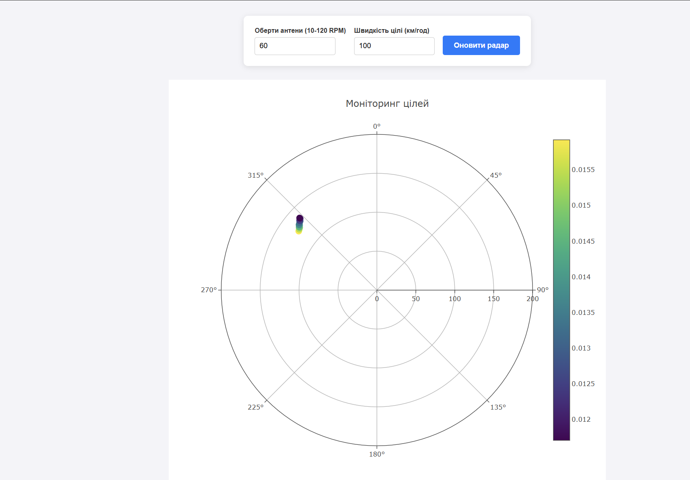

# Лабораторна робота №2: Розробка додатку для візуалізації вимірювань радару
# Панченко Даниїл, ІПЗ-4.01

## Короткий опис роботи
Метою лабораторної роботи є розробка веб-додатку, який інтегрується з емулятором радарної станції (Docker image) та візуалізує отримані дані в режимі реального часу.
У рамках проекту було реалізовано:
* **WebSocket-клієнт:** Для отримання потокових JSON-даних про кут нахилу антени та параметри цілей (час затримки, потужність).
* **Математичний модуль:** Обчислення відстані до цілі за часом поширення сигналу ($R = \frac{c \cdot t}{2}$).
* **Візуалізація:** Полярний графік на базі бібліотеки Plotly з динамічним оновленням та колірною індикацією потужності сигналу (Scale Viridis).
* **Модуль управління (API):** Реалізовано відправку PUT-запитів для зміни конфігурації радара (RPM антени та швидкість цілі).

---

## Інструкції для запуску проекту
Для успішного запуску та взаємодії з радаром виконайте наступні кроки:

1. **Запуск серверної частини (Docker):**
   Виконайте команду в терміналі для запуску емулятора:
   `docker run --name radar-emulator -p 4000:4000 iperekrestov/university:radar-emulation-service`
2. **Запуск клієнтської частини:**
   * Оскільки для зміни конфігурації через API використовуються методи HTTP PUT, файл `index.html` необхідно відкривати через **Live Server** (або будь-який локальний веб-сервер), щоб уникнути обмежень політики CORS.
3. **Залежності:** Проект підключає бібліотеку Plotly через CDN, тому необхідне стабільне підключення до мережі Інтернет.

---

## Результати перевірки коректності
Система коректно обробляє вхідний потік даних. На графіку відображається "шлейф" з останніх точок, що дозволяє візуально відстежувати траєкторію руху об'єктів. Кут відображення (theta) на графіку синхронізований з даними `scanAngle`, що надходять від емулятора.

Скриншот працюючого інтерфейсу та панелі управління:

---

### Аналіз та висновки 

**Вплив параметрів на візуалізацію:**
Як було встановлено експериментально, зміна `rotationSpeed` безпосередньо впливає на щільність точок на графіку. При низьких обертах (10 RPM) точки розташовуються дуже щільно, що підвищує точність візуального спостереження, але уповільнює оновлення всієї 360-градусної карти. При швидкості 5000 км/год для цілі, час ToA (Time of Arrival) зменшується стрімко, що підтверджує коректність математичної моделі обчислення відстані.

**Оптимізація:**
Для забезпечення стабільного FPS (кадрів за секунду) було прийнято рішення використовувати `setInterval` з інтервалом 100 мс для функції `restyle`. Це дозволяє уникнути перевантаження головного потоку (main thread) браузера при отриманні великої кількості пакетів через WebSocket на високих швидкостях обертання антени.

---

## Загальний висновок
Під час виконання лабораторної роботи було опановано роботу з мережевими протоколами WebSocket та HTTP API. Головним результатом стало створення інтерактивної системи, де фізичні параметри об'єкта (швидкість, відстань) та налаштування обладнання (RPM) синхронізовані між серверною частиною та графічним інтерфейсом користувача. Розроблена модель ілюструє важливість балансу між частотою отримання даних та ресурсами системи для їх візуалізації.
